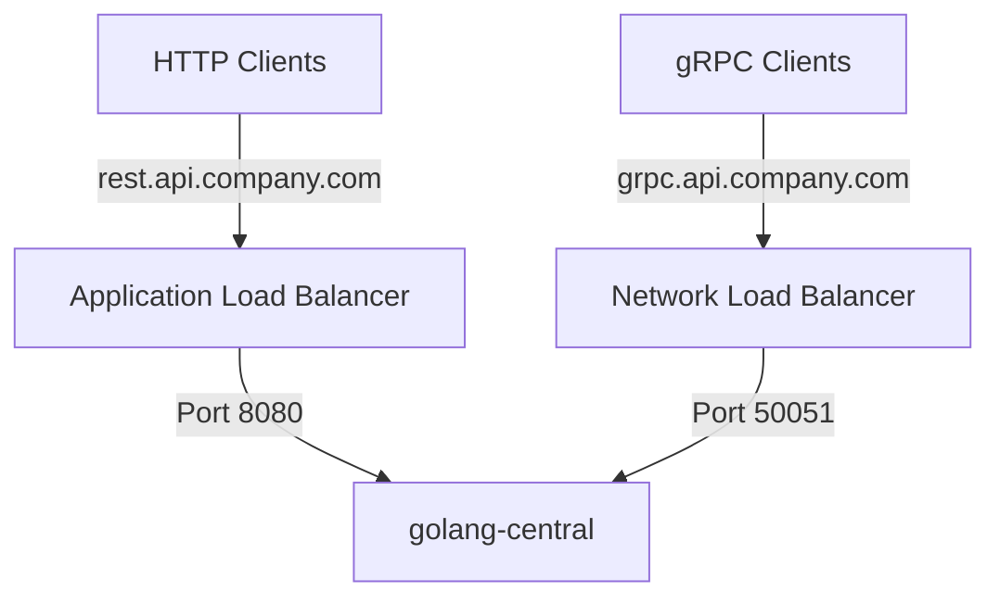
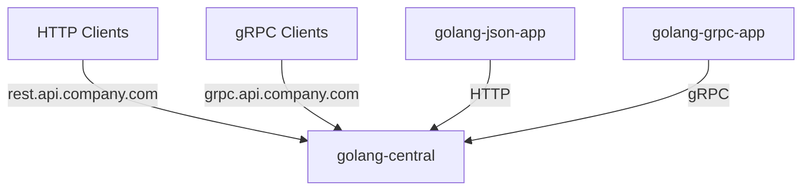

# Golang NexusPoint

A microservices-based user management system demonstrating different communication protocols in Go.

## Production Deployment

### Domain Structure
```
api.company.com              # Main API domain
├── grpc.api.company.com     # gRPC endpoint (Port 50051)
└── rest.api.company.com     # REST endpoint (Port 8080)
```

### Infrastructure Setup


### Client Configuration
```yaml
# Example client configuration
services:
  golang-central:
    rest:
      endpoint: "rest.api.company.com"
      port: 443
      protocol: "https"
    grpc:
      endpoint: "grpc.api.company.com"
      port: 50051
      protocol: "grpc"
```

## API Endpoints

### golang-central Service

#### REST API (rest.api.company.com)
```http
GET https://rest.api.company.com/get-users
Content-Type: application/json

Response:
[
  {
    "id": 1,
    "name": "John Doe",
    "email": "john@example.com",
    "location": "New York"
  }
]
```

#### gRPC API (grpc.api.company.com:50051)
```protobuf
service UserService {
  rpc GetUsers(GetUsersRequest) returns (GetUsersResponse) {}
  rpc GetProfile(GetProfileRequest) returns (GetProfileResponse) {}
}
```

### When to Use Which API

1. **Use REST API when**:
   - You need simple, human-readable API calls
   - You're working with web browsers or mobile apps
   - You need easy debugging with tools like curl or Postman
   - You're integrating with systems that don't support gRPC
   - You need to use HTTP/1.1

2. **Use gRPC API when**:
   - You need high-performance communication
   - You're working with microservices
   - You need bi-directional streaming
   - You want strong typing and code generation
   - You need to use HTTP/2
   - You're working with Go, Java, Python, or other gRPC-supported languages

## Architecture



## Project Structure

```
.
├── golang-central/          # Central service with both HTTP and gRPC endpoints
│   ├── main.go             # Server implementation
│   └── proto/              # Generated protobuf files
│
├── golang-json-app/        # REST API client
│   └── main.go            # HTTP client implementation
│
├── golang-grpc-app/       # HTTP-to-gRPC bridge
│   ├── main.go           # HTTP server with gRPC client
│   └── proto/            # Generated protobuf files
│
└── proto/                # Shared Protocol Buffers definitions
    ├── proto/user.proto  # User service definition
    └── generate.sh       # Script to generate protobuf files
```

## Service Descriptions

### golang-central (Port: 8080, 50051)
- Acts as the central service
- Provides both HTTP and gRPC endpoints
- Serves static user and profile data
- Implements the UserService gRPC interface
- Handles concurrent HTTP and gRPC requests
- Production endpoints:
  - REST: rest.api.company.com
  - gRPC: grpc.api.company.com:50051

### golang-json-app (Port: 8081)
- REST API client
- Communicates with golang-central via HTTP
- Provides a /users endpoint that proxies requests to golang-central
- Returns user data in JSON format

### golang-grpc-app (Port: 8082)
- HTTP-to-gRPC bridge service
- Provides HTTP endpoints for clients:
  - `/users` - Get all users
  - `/profile?user_id=<id>` - Get user profile
- Uses optimized single gRPC client connection
- Converts gRPC responses to JSON format
- Demonstrates protocol translation

## Protocol Buffers
The system uses Protocol Buffers for service definitions:
- User service with GetUsers and GetProfile RPC methods
- Shared proto files ensure consistent data structures
- Generated code handles serialization/deserialization
- Proto files are automatically generated and copied to required locations

## Communication Flow
1. Clients can access data through:
   - HTTP: rest.api.company.com
   - gRPC: grpc.api.company.com:50051
   - HTTP-to-gRPC: golang-grpc-app (port 8082)
2. golang-central receives requests via HTTP or gRPC
3. golang-central serves static user and profile data
4. Data is returned in JSON format to clients

## Setup and Running
1. Generate Protocol Buffer code:
   ```bash
   cd proto && ./generate.sh
   ```
   This will:
   - Generate protobuf files
   - Copy them to golang-central and golang-grpc-app directories

2. Start the central service:
   ```bash
   cd golang-central && go run main.go
   ```

3. Start the JSON client:
   ```bash
   cd golang-json-app && go run main.go
   ```

4. Start the HTTP-to-gRPC bridge:
   ```bash
   cd golang-grpc-app && go run main.go
   ```

5. Test the APIs:
   ```bash
   # Test REST API
   curl https://rest.api.company.com/get-users
   
   # Test gRPC API (using grpcurl)
   grpcurl -plaintext grpc.api.company.com:50051 user.UserService/GetUsers
   grpcurl -plaintext -d '{"user_id": 1}' grpc.api.company.com:50051 user.UserService/GetProfile
   
   # Test HTTP-to-gRPC bridge
   curl http://localhost:8082/users
   curl "http://localhost:8082/profile?user_id=1"
   ```

## Dependencies
- Go 1.21 or later
- Protocol Buffers compiler (protoc)
- google.golang.org/grpc
- google.golang.org/protobuf

## Current Features
- ✅ HTTP and gRPC communication
- ✅ Protocol Buffer definitions
- ✅ Automatic proto file generation
- ✅ Static user and profile data serving
- ✅ Concurrent request handling
- ✅ JSON and binary data formats
- ✅ HTTP-to-gRPC bridge functionality
- ✅ Optimized gRPC client connection
- ✅ Profile management

## Future Improvements
- [ ] Add database integration
- [ ] Implement user authentication
- [ ] Add request logging
- [ ] Implement rate limiting
- [ ] Add health check endpoints
- [ ] Add user creation/update endpoints
- [ ] Add TLS/SSL configuration
- [ ] Add API versioning