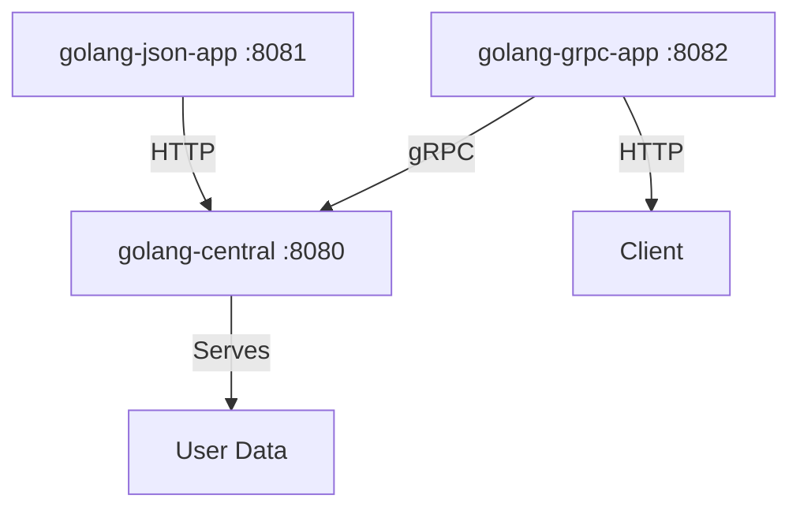

# Golang NexusPoint

A microservices-based user management system demonstrating different communication protocols in Go.

## Architecture



## Project Structure

```
.
├── golang-central/          # Central service with both HTTP and gRPC endpoints
│   ├── main.go             # Server implementation
│   └── proto/              # Generated protobuf files
│
├── golang-json-app/        # REST API client
│   └── main.go            # HTTP client implementation
│
├── golang-grpc-app/       # HTTP-to-gRPC bridge
│   ├── main.go           # HTTP server with gRPC client
│   └── proto/            # Generated protobuf files
│
└── proto/                # Shared Protocol Buffers definitions
    ├── proto/user.proto  # User service definition
    └── generate.sh       # Script to generate protobuf files
```

## Service Descriptions

### golang-central (Port: 8080, 50051)
- Acts as the central service
- Provides both HTTP (/get-users) and gRPC endpoints
- Serves static user data
- Implements the UserService gRPC interface
- Handles concurrent HTTP and gRPC requests

### golang-json-app (Port: 8081)
- REST API client
- Communicates with golang-central via HTTP
- Provides a /users endpoint that proxies requests to golang-central
- Returns user data in JSON format

### golang-grpc-app (Port: 8082)
- HTTP-to-gRPC bridge service
- Provides HTTP endpoint (/users) for clients
- Internally makes gRPC calls to golang-central
- Converts gRPC responses to JSON format
- Demonstrates protocol translation

## Protocol Buffers
The system uses Protocol Buffers for service definitions:
- User service with GetUsers RPC method
- Shared proto files ensure consistent data structures
- Generated code handles serialization/deserialization
- Proto files are automatically generated and copied to required locations

## Communication Flow
1. Clients can access user data through:
   - HTTP: golang-json-app (port 8081)
   - HTTP-to-gRPC: golang-grpc-app (port 8082)
2. golang-central receives requests via HTTP or gRPC
3. golang-central serves static user data
4. Data is returned in JSON format to clients

## Setup and Running
1. Generate Protocol Buffer code:
   ```bash
   cd proto && ./generate.sh
   ```
   This will:
   - Generate protobuf files
   - Copy them to golang-central and golang-grpc-app directories

2. Start the central service:
   ```bash
   cd golang-central && go run main.go
   ```

3. Start the JSON client:
   ```bash
   cd golang-json-app && go run main.go
   ```

4. Start the HTTP-to-gRPC bridge:
   ```bash
   cd golang-grpc-app && go run main.go
   ```

5. Test the APIs:
   ```bash
   # Test HTTP endpoint
   curl http://localhost:8081/users
   
   # Test HTTP-to-gRPC bridge
   curl http://localhost:8082/users
   ```

## Dependencies
- Go 1.21 or later
- Protocol Buffers compiler (protoc)
- google.golang.org/grpc
- google.golang.org/protobuf

## Current Features
- ✅ HTTP and gRPC communication
- ✅ Protocol Buffer definitions
- ✅ Automatic proto file generation
- ✅ Static user data serving
- ✅ Concurrent request handling
- ✅ JSON and binary data formats
- ✅ HTTP-to-gRPC bridge functionality

## Future Improvements
- [ ] Add database integration
- [ ] Implement user authentication
- [ ] Add request logging
- [ ] Implement rate limiting
- [ ] Add health check endpoints