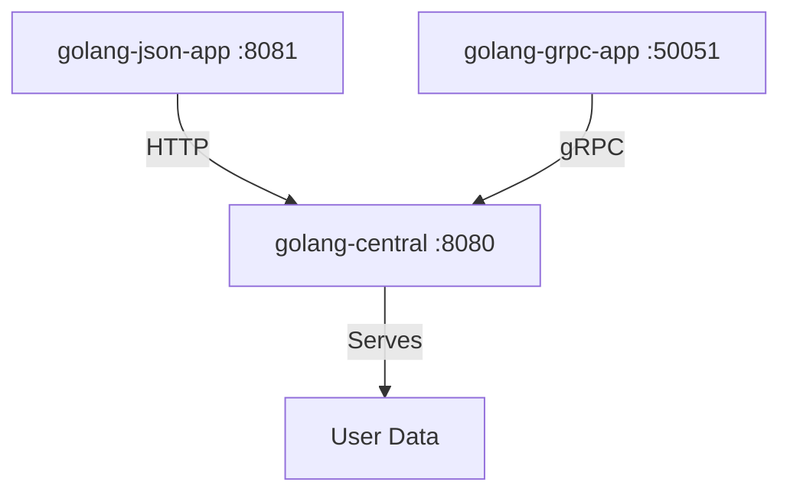

# Golang NexusPoint

A microservices-based user management system demonstrating different communication protocols in Go.

## Architecture



## Project Structure

```
.
├── golang-central/          # Central service with both HTTP and gRPC endpoints
│   ├── main.go             # Server implementation
│   └── proto/              # Generated protobuf files
│
├── golang-json-app/        # REST API client
│   └── main.go            # HTTP client implementation
│
├── golang-grpc-app/       # gRPC client
│   ├── main.go           # gRPC client implementation
│   └── proto/            # Generated protobuf files
│
└── proto/                # Shared Protocol Buffers definitions
    └── proto/user.proto  # User service definition
```

## Service Descriptions

### golang-central (Port: 8080, 50051)
- Acts as the central service
- Provides both HTTP (/get-users) and gRPC endpoints
- Serves static user data
- Implements the UserService gRPC interface

### golang-json-app (Port: 8081)
- REST API client
- Communicates with golang-central via HTTP
- Provides a /users endpoint that proxies requests to golang-central

### golang-grpc-app (Port: 50051)
- gRPC client implementation
- Communicates with golang-central via gRPC
- Implements the same UserService interface

## Protocol Buffers
The system uses Protocol Buffers for service definitions:
- User service with GetUsers RPC method
- Shared proto files ensure consistent data structures
- Generated code handles serialization/deserialization

## Communication Flow
1. Clients (golang-json-app or golang-grpc-app) request user data
2. golang-central receives requests via HTTP or gRPC
3. golang-central serves static user data
4. Data is returned in JSON or Protocol Buffer format

## Setup and Running
1. Generate Protocol Buffer code:
   ```bash
   cd proto && ./generate.sh
   ```

2. Start the central service:
   ```bash
   cd golang-central && go run main.go
   ```

3. Start the JSON client:
   ```bash
   cd golang-json-app && go run main.go
   ```

4. Start the gRPC client:
   ```bash
   cd golang-grpc-app && go run main.go
   ```

## Dependencies
- Go 1.22 or later
- Protocol Buffers compiler (protoc)
- google.golang.org/grpc
- google.golang.org/protobuf